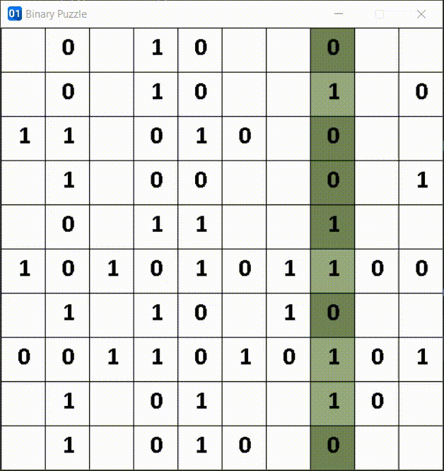

# Binary Puzzle
this project represents a `CSP backtracking algorithm` that can solve `the binary puzzles`,
the binary puzzle consists of an n * n table where n is an even number and
the player must place the numbers zero or one in the empty cells so that:  

* each row and each column must have an equal number of zeros and ones  
* the numbers in each row and column must produce a unique string  
* there should be no more than 2 duplicates in each row and column
  
for example, consider the table in four of the following:
```bash
1   0   0   1
0   1   1   0
1   1   0   0
0   0   1   1
```
1. the number of rows in each row and column is equal to the number of one in that row and column.
2. the string columns 1010, 0110, 0101, and 1001 are unique, and the row strings are similarly unique. 
3. in no row or column are more than two one or two zeros together.  

## Usage  
#### Requirements
we used numpy array for increasing speed, then you should install `numpy` library.
```bash
$ pip install numpy
```
also, we used `pygame` for visualizing solving procedure.
```bash
$ pip install pygame
```
#### Run 
```bash
$ python3 csp.py
```

#### Example Run
``` bash
$ python3 csp.py
Which constraint propagation algorithm would you prefer?
 1) MAC
 2) Forward Checking
1
10 10
- 0 - - - - - - - -
- 0 - - - - - 1 - 0
1 - - - 1 0 - - - -
- - - 0 - - - - - 1
- - - - 1 - - - - -
- - - - - - 1 1 - -
- 1 - 1 - - 1 - - -
0 - - - - - - - 0 -
- 1 - - 1 - - 1 0 -
- - - 0 - 0 - - - -
```
then you can see the solving procedure as follows  



## License

Distributed under the MIT License. See `LICENSE.md` for more information.  

## Developers
[Amin Habibollah](https://github.com/aminhbl)  
[Amirreza Naziri](https://github.com/Amir79Naziri)  
